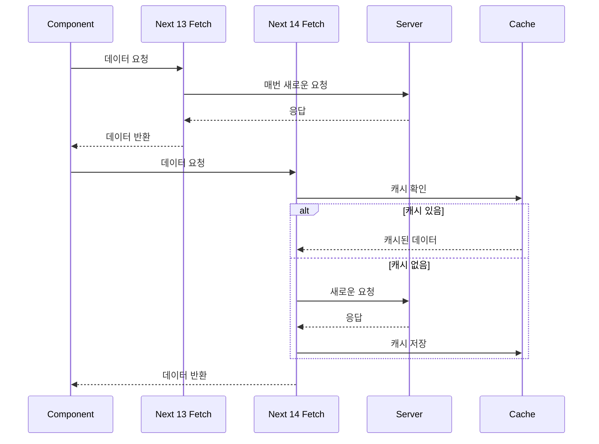

Next.js 14가 출시되면서 데이터 `fetching` 방식에 큰 변화가 있다.
이번 글에서는 Next.js14의 새로운 `fetch`기능을 살펴보고, 이전 버전 및 `React Query`와 비교해 보겠습니다.
또한, Next.js 14 환경에서 React Query를 사용하는게 적절한가 ? 와 효과적으로 사용하는 방법에 대해서도 알아보겠습니다.

### 1. Next 14의 새로운 fetch 기능
Next 14에서는 내장 `fetch`함수에 중요한 개선사항이 추가 되었다.
- **자동 중복 제거** :동일한 요청은 한 번만 실행된다.
- **자동 캐싱** : 결과가 자동으로 캐시된다.

```tsx
// app/(home)/page.js
async function getData() {
  const res = await fetch('https://api.example.com/data');
  
export default async function Page() {
  const data = await getData()
  return <main>{/* 데이터를 사용하여 UI 렌더링 */}</main>
}
```
- 이 코드에서 `fetch` 함수는 **자동으로 결과를 캐시**하고, **동일한 요청이 여러 번 발생해도 한 번만 실행**됩니다.

### 2. Next 13, Next 14 fetch 비교

- 위 다이어그램에서 볼 수 있듯이, Next.js 14의 `fetch`는 **자동 캐싱**과 **중복 제거 기능**을 제공하여 **불필요한 서버 요청을 줄이고 성능을 향상** 시킨다.

### Next.js 13의 한계와 React Query의 등장
💡 해당 부분은 Next 14버전에서 React Query를 쓰는 이유를 찾으려면, Next 13 이전 버전에서 사용한 이유를 알아야 할 것 같아서 추가했습니다.

💡 Next.js 13에서는 데이터 fetching에 몇 가지 한계가 있었습니다
- **수동 캐싱 관리:** 개발자가 직접 캐싱 로직을 구현해야 했습니다.
- **중복 요청 가능성:** 동일한 데이터에 대해 여러 번 요청이 발생할 수 있었습니다.
- **복잡한 상태 관리:** 로딩, 에러 상태 등을 수동으로 관리해야 했습니다.

💡 이러한 이슈들 때문에 React Query같은 서버 상태 관리 라이브러리를 사용했습니다. (React Query만 있는게 아닙니다!)
	- 자동 캐싱 및 재검증
	- 중복 요청 방지
	- 로딩 및 에러 상태 자동 관리
	- 데이터 동기화 및 백그라운드 업데이트
	- 예제 코드
```js
// React Query 사용 예시
import { useQuery } from 'react-query'

function MyComponent() {
  const { data, isLoading, error } = useQuery('myData', fetchData)

  if (isLoading) return <div>로딩 중...</div>
  if (error) return <div>에러 발생!</div>

  return <div>{data}</div>
}
```

### Next 14와 React Query 적절한 사용

#### Next.js 14의 주요 특징
Next.js 14에서 데이터 fetching이 크게 개선되어, 많은 경우를 React Query를 대체할 수 있게 되었다.
- **자동 중복 제거**: 동일한 요청은 한 번만 실행됩니다.
- **자동 캐싱**: 결과가 자동으로 캐시되어 성능이 향상됩니다.
- **서버 컴포넌트 통합**: 서버에서 직접 데이터를 가져와 초기 로드 시간을 단축시킵니다.
- **유연한 렌더링 전략**: `revalidate` 옵션으로 정적/동적 콘텐츠를 효과적으로 관리합니다.
- **타입 안전성**: TypeScript와의 완벽한 통합으로 타입 관련 오류를 줄입니다.
##### 💡 아 그럼 데이터 변경(mutate)의 경우도 되나요?
```tsx
'use server'

async function updateData(newData) {
  // 데이터 업데이트 로직
  revalidatePath('/data')  // 특정 경로의 데이터 재검증
}
```
하지만 Next.js 14만으로는 해결하기 어려운 시나리오가 있습니다:

1. **복잡한 캐싱 전략**: 세밀한 캐시 무효화, 조건부 리fetching
2. **실시간 데이터 업데이트**: 실시간 채팅, 라이브 피드 등
3. **복잡한 데이터 동기화**: 오프라인 지원, 낙관적 업데이트
4. **고급 로딩 상태 관리**: 무한 스크롤, 복잡한 페이지네이션
5. **클라이언트/서버 상태 복합 관리**: 실시간 필터링, 고급 검색 기능

이와 같은 경우는 React Ueryy 만의 갈정이 여전히 유호ㅛ하다.
```jsx
const { data, isLoading, error } = useQuery('userData', fetchUserData, {
  staleTime: 5000,
  cacheTime: 10 * 60 * 1000,
  refetchOnWindowFocus: false,
});
```