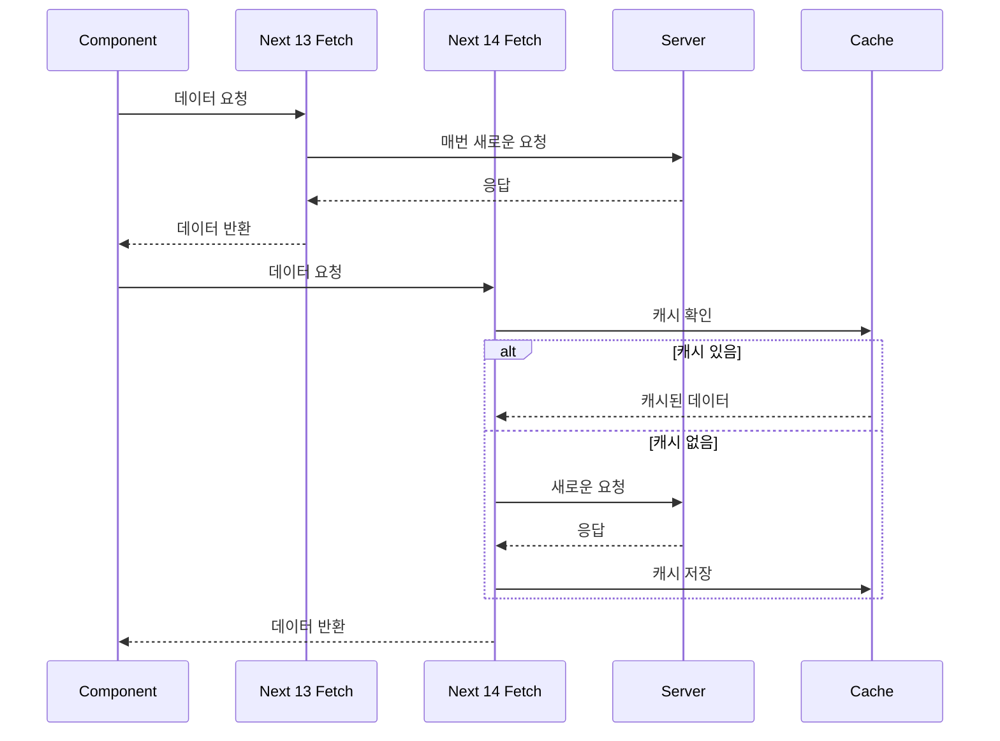
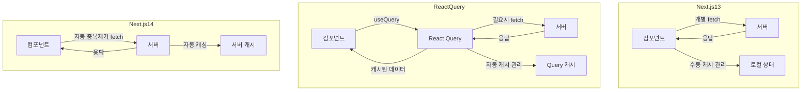

Next.js 14가 출시되면서 데이터 `fetching` 방식에 큰 변화가 있다.
이번 글에서는 Next.js14의 새로운 `fetch`기능을 살펴보고, 이전 버전 및 `React Query`와 비교해 보겠습니다.
또한, Next.js 14 환경에서 React Query를 사용하는게 적절한가 ? 와 효과적으로 사용하는 방법에 대해서도 알아보겠습니다.

### 1. Next.js 14 fetch 사용법부터 알아봅시다. 
Next.js 14에서는 내장된 `fetch` 함수를 사용하여 데이터를 가져올 수 있습니다.
이 `fetch` 함수는 자동 중복 제거와 캐싱 기능을 제공합니다.

```tsx
// app/(home)/page.js
async function getData() {
  const res = await fetch('https://api.example.com/data')
  if (!res.ok) {
    throw new Error('Failed to fetch data')
  }
  return res.json()
}

export default async function Page() {
  const data = await getData()
  return <main>{/* 데이터를 사용하여 UI 렌더링 */}</main>
}
```
- 이 코드에서 `fetch` 함수는 자동으로 결과를 캐시하고, 동일한 요청이 여러 번 발생해도 한 번만 실행됩니다.

### 2. Next 13, Next 14 fetch 비교

- 위 다이어그램에서 볼
### Next 13, Next 14, React-Query 데이터 흐름도 비교

- Next 14 
	- 클라이언트와 서버 컴포넌트 모두 동일한 `fetch` 매커니즘 사용한다.
	- 자동 중복 제거 기능이 내장되어 있다.
	- 서버 측에서 자동 캐싱이 이루어진다.
	- 재 검증 옵션을 통해 캐시 갱신을 제어 할 수 있다.
- Next.js 13:
    - 클라이언트와 서버 컴포넌트가 개별적으로 fetch 요청을 수행한다.
    - 캐싱은 수동으로 관리해야 한다.
    - 중복 요청 방지를 위해 추가 로직이 필요할 수 있습니다.
- React Query:
    - 컴포넌트는 useQuery 훅을 통해 데이터를 요청합니다.
    - React Query가 중앙에서 캐시를 관리합니다.
    - 자동 재시도, 백그라운드 갱신 등의 고급 기능을 제공합니다.
    - invalidateQueries를 통해 캐시를 수동으로 무효화할 수 있습니다.


- Next.js 14는 13버전에 비해 더 간단하고 효율적인 데이터 흐름을 제공합니다. 그러나 React Query는 여전히 더 복잡한 클라이언트 사이드 상태 관리 시나리오에서 강력한 도구로 남아있습니다.

프로젝트의 요구사항에 따라 Next.js 14의 내장 기능만으로 충분할 수도 있고, React Query의 고급 기능이 필요할 수도 있습니다. 때로는 두 접근 방식을 혼합하여 사용하는 것이 최적의 솔루션이 될 수 있습니다.